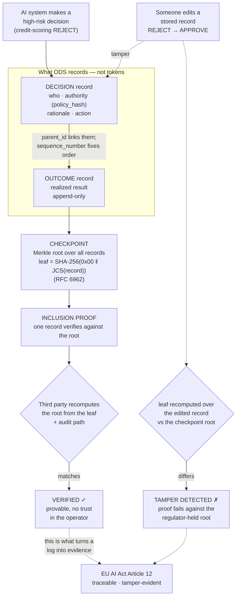

# ORPI Quickstart — verifiable AI decision records in one command

> An AI system makes a high-risk decision. Six months later, a regulator asks:
> *"Prove what it decided, on what basis — and that the record hasn't been
> altered since."* Your application and inference logs can't answer that.
> This 60-second demo shows what can.

## Run it

No installation, no dependencies. Python 3.9+.

```bash
python orpi_demo.py
```

That's it. You'll watch a credit-scoring rejection get recorded as a verifiable
ODS decision record, anchored in a Merkle checkpoint, proven with an inclusion
proof a third party can check **without trusting you** — and then you'll watch
the proof break the instant someone edits the stored record.

## What you just saw

| Step | What happens | Why it matters for EU AI Act Article 12 |
|------|--------------|------------------------------------------|
| DECISION | Records *who* decided, *under what authority* (policy hash), the *rationale*, and the *action* — not tokens | Article 12 wants the decision event traceable, not just the model I/O |
| OUTCOME | The realized result, cryptographically linked to the decision, append-only | The lifecycle, not a snapshot |
| CHECKPOINT | A Merkle root over all records — the anchor a regulator or auditor keeps | One small fingerprint commits the whole history |
| PROOF | Any single record verifies against the checkpoint root, standalone | Independent verification, no trust in the operator |
| TAMPER | Editing a stored record makes the hash and the proof fail, visibly | A log you can silently alter has zero evidentiary value; this can't be |

## The flow



## What this is

This is the runnable front door to the **Open Decision Standard (ODS / ORPI)** —
an open standard for verifiable, immutable AI decision records under human
authority. The standard pins JSON canonicalization (RFC 8785) and Merkle trees
(RFC 6962) exactly, and ships a conformance suite. This demo is a teaching
reference: ~250 lines of stdlib Python so you can read every line and see there
is no magic — just domain-separated Merkle leaves and inclusion proofs applied to *decisions*, the
events that actually carry accountability.

The full standard, schema, validator, and conformance suite:
**github.com/ODS-Foundation/ods-specification**

## Where it fits

ODS is the *decision-record* layer. It sits above the agent-identity and
delegation-provenance work emerging at the IETF and the Linux Foundation: those
say *which* agent acted and *under whose* authorization; ODS records *what was
decided, on what basis, with what outcome* — verifiably. It is meant to
interoperate, not to replace.
